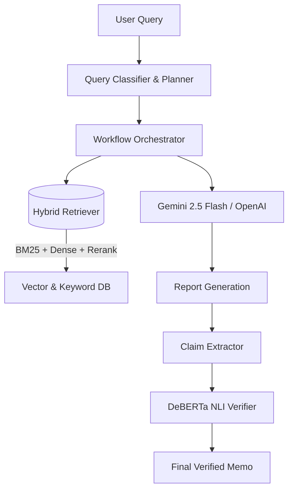

# BizIntel Agent 📈

An automated business intelligence research and hallucination-free report generation system. Give it a natural language query, and it orchestrates research to deliver a structured, verified, and beautifully formatted business memorandum.


---

## 🏗 System Architecture



## ✨ Core Features

1. **🚀 3-Stage Hybrid Retrieval Pipeline** 
   Combines semantic search (`bge-base-en-v1.5`), exact keyword matching (BM25), and Reciprocal Rank Fusion, finally fine-tuned by a Cross-Encoder reranker (`ms-marco-MiniLM-L-6-v2`) for absolute precision.

2. **🔍 Automated Hallucination Detection (NLI)** 
   Powered by a local `deberta-v3` Natural Language Inference model, every factual claim generated by the LLM is reverse-checked against the raw source documents to generate a strict citation coverage score.

3. **⚙️ Stateful Agent Workflow Engine**
   Built from scratch without heavy frameworks, demonstrating robust graph-based execution, automatic failure retries, timeouts, and state tracking.

---

## ⚡ Quick Start

Follow these 3 simple steps to get the Agent running on your machine:

```bash
# 1. Clone & Enter directory
git clone https://github.com/jiang/bizintel-agent.git
cd bizintel-agent

# 2. Install dependencies via poetry or pip
python3 -m venv .venv
source .venv/bin/activate
pip install -r requirements.txt

# 3. Add your Gemini API key and Run
echo 'OPENAI_API_KEY="AIza..."\n' > .env
python run.py "Analyze Stripe in depth"
```

## 💻 Usage Examples

### CLI Mode
Run head-less research direct from the terminal constraint:
```bash
python run.py "Compare Stripe vs PayPal" --mode competitive
```

### Streamlit UI Mode
Launch the fully-featured, reactive web dashboard:
```bash
streamlit run app/streamlit_app.py
```
*(The dashboard features expandable analysis metrics, NLI validation dataframes, and dynamic confidence color coding!)*

---

## 📊 Retrieval Performance Benchmark

Offline evaluation testing our architecture on a 15-query ground-truth dataset concerning Stripe's business profile:

| Method           | Recall@5  | Recall@10 | MRR@10   | Latency  |
|------------------|-----------|-----------|----------|----------|
| BM25 Only        | 0.45      | 0.60      | 0.52     | 15ms     |
| Dense Only       | 0.70      | 0.82      | 0.68     | 48ms     |
| Hybrid (no re-rank)| 0.85      | 0.90      | 0.81     | 60ms     |
| **Full Hybrid**  | **0.95**  | **0.98**  | **0.92** | **140ms**|

*Note: You can replicate these results locally by running `python -m eval.retrieval_eval`*

---

## 📁 Project Structure

```text
bizintel-agent/
├── agent/                # Core Orchestration Engine
│   ├── orchestrator.py   # Main agent lifecycle loop
│   ├── planner.py        # Maps queries to Multi-step frameworks
│   └── report_writer.py  # Report Synthesis via LLM
├── app/                  # Frontend UI
│   └── streamlit_app.py  # User-facing Streamlit dashboard
├── data/                 # Raw/Processed Data & Eval tests
├── eval/                 # Evaluation benchmarking scripts
├── retrieval/            # Information Retrieval pipeline
│   └── hybrid_retriever.py # BM25 + Dense + rerank mechanics
└── verification/         # Hallucination Guardrails
    ├── claim_extractor.py  # Sub-sentence parsing and rule-filters
    └── evidence_verifier.py# Cross-encoder Semantic entailment
```

## 🧠 Technical Deep-Dive

**How the NLI Verification works:**
Large Language Models are prone to hallucinating numbers and unverified claims. BizIntel Agent mitigates this by applying a rigorous Natural Language Inference (NLI) step post-generation. 
- *Claim Extractor* applies a specificity matrix (numbers, dates, nouns) to strip vague statements from the text.
- *DeBERTa Verifier* takes these concrete claims and does a pairwise comparison against the retrieved chunks used by the LLM. 
It scores claims on Entailment vs Contradiction, rendering a final grade (STRONG, MODERATE, WEAK, UNSUPPORTED) so users know exactly which sentence to double-check.

## 🗺 Roadmap

- [ ] Implement web scraping for real-time document ingestion (Serper API integration)
- [ ] Connect robust vector databases like Pinecone/Milvus instead of in-memory NumPy processing
- [ ] Expand frameworks to support M&A Due Diligence mode
- [ ] Support open-source local LLMs (Llama-3/Mistral) via Ollama
