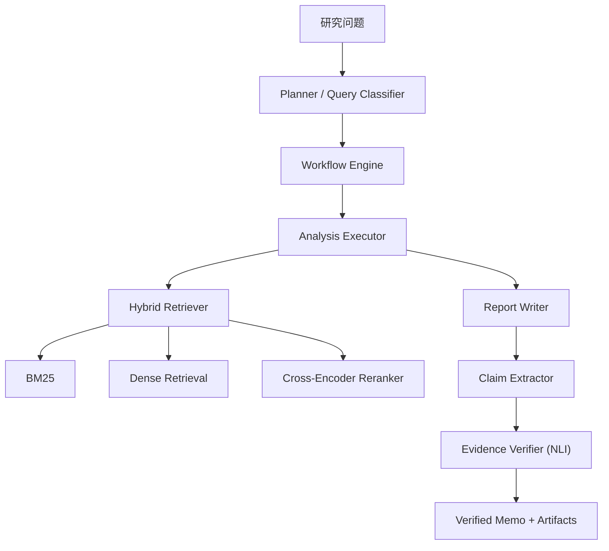

# 证据驱动可验证的企业财务研究Agent Flow

一个面向企业财务与商业研究的证据驱动 Agent 系统。它接收研究问题，自动拆解分析步骤，从本地企业资料包中检索证据，生成结构化研究备忘录，并对关键断言做逐条核验，帮助你区分“有证据支撑的判断”和“需要进一步确认的说法”。

对外展示名称是 `证据驱动可验证的企业财务研究Agent Flow`；为保持代码兼容，仓库目录、包名和核心类名仍保留 `bizintel-agent` / `BizIntelAgent`。


## 项目定位

这个项目不是通用聊天助手，也不是实时行情终端。它更准确的定位是：

- 一个面向企业研究的证据优先工作流
- 一个把检索、生成、核验串起来的可解释 Agent 系统
- 一个能输出研究 memo、流程 trace 和核验结果的演示型产品原型

当前最适合的场景是：基于整理好的公司资料包，生成第一版研究备忘录、梳理业务理解、财务质量、估值线索、跟踪指标和主要风险。

## 核心能力

1. **多阶段分析规划**
   系统会先判断问题属于公司深度研究、行业分析还是竞品比较，再生成对应的分析步骤和检索查询。

2. **混合检索而不是单次向量召回**
   检索层结合了 BM25、dense embeddings、RRF 融合和 cross-encoder rerank，尽量减少“语义接近但证据不够硬”的情况。

3. **证据驱动写作**
   每个 section 都基于检索回来的 evidence chunks 生成，输出目标是结构化 memo，不是泛泛而谈的总结。

4. **断言级核验**
   报告生成后会提取 claims，并用 NLI verifier 对照原始证据做支持度判断，给出 `STRONG`、`MODERATE`、`WEAK`、`UNSUPPORTED` 等标签。

5. **六阶段 Prompt 工程**
   系统把研究流程拆成 `Research Planner`、`Query Generator`、`Evidence Structurer`、`Gap Reflector`、`Grounded Writer`、`Strict Verifier` 六个阶段，统一遵守证据优先、数字纪律和不确定性显式化的约束。

6. **单 Agent 的 gap-filling 执行循环**
   每个 section 不再“一次检索直接写完”，而是按“检索 → 证据整理 → 检查缺口 → 补检索”的循环推进，直到覆盖完必答事实、没有新增证据或达到轮数上限。

7. **发布前删改而不是事后自我安慰**
   writer 会在最终输出前做一轮严格 gating：数值型 unsupported 直接删掉，非数值 unsupported 会被降级成 `insufficient evidence`，而不是继续混在正文里。

8. **双入口交互**
   同一套后端既可通过 CLI 运行，也可通过 Streamlit UI 演示，并导出 `memo.md`、`trace.json`、`summary.json`、`verification.csv` 等产物。

## 系统架构



更完整的技术说明见：

- [docs/architecture.md](docs/architecture.md)
- [docs/full_flow_architecture.md](docs/full_flow_architecture.md)
- [docs/interview_walkthrough.md](docs/interview_walkthrough.md)

## 工作流

1. 用户输入研究问题。
2. `Planner` 判断分析模式，生成 section-level contract，包括 `required_slots`、允许来源类型、禁止外推的 claim 类型和降级规则。
3. `AnalysisExecutor` 对每一步发起检索，整理 `evidence_ledger`、`evidence_notes`，并显式记录 `covered_facts` / `missing_facts` / `gap_reflection`。
4. `ReportWriter` 基于 evidence-first 规则生成 section，并在发布前做 claim-level gating。
5. `ClaimExtractor` 与 `EvidenceVerifier` 对具体断言做核验，并输出支持度结果。
6. `Artifacts` 层落盘 `memo.md`、`trace.json`、`summary.json`、`verification.csv`，方便复盘“计划 -> 证据 -> 结论”的完整链路。

## 支持的研究模式

- `company_deep_dive`
  适合单一公司的业务、财务质量、估值线索与风险梳理。

- `industry_landscape`
  适合行业结构、趋势、竞争格局与上下游关系分析。

- `competitive_comparison`
  适合两家公司或多家公司之间的对比研究。

## 快速开始

```bash
# 1. 进入仓库
cd bizintel-agent

# 2. 创建虚拟环境
python3 -m venv .venv
source .venv/bin/activate

# 3. 安装依赖
make install
```

如果你需要启用在线模型调用，创建 `.env`。当前代码使用的是 OpenAI-compatible `chat.completions` 客户端，因此既可以用 `OPENAI_*` 变量，也兼容项目之前的 `MINIMAX_*` / `ANTHROPIC_*` 别名：

```bash
cat > .env <<'EOF'
OPENAI_API_KEY="your-api-key"
OPENAI_API_BASE="https://callflow.top/v1"
OPENAI_MODEL="gpt-5.2"
EOF
```

如果你仍然想沿用旧环境变量名，也可以：

```bash
cat > .env <<'EOF'
MINIMAX_API_KEY="your-api-key"
MINIMAX_API_BASE="https://callflow.top/v1"
MINIMAX_MODEL="gpt-5.2"
EOF
```

如果你只是想先看一遍完整流程，直接运行：

```bash
make demo
```

这会生成一组可检查的演示产物到 `artifacts/demo/`。

## 使用方式

### CLI

```bash
python run.py "Assess Stripe's revenue quality, valuation drivers, and key monitorables" --mode company
```

输出附带产物：

```bash
python run.py "Compare Stripe vs PayPal" --mode competitive --artifact-dir artifacts/compare --trace
```

### Web UI

```bash
make ui
```

UI 中可以：

- 输入研究问题
- 强制指定分析模式
- 切换离线 demo 模式
- 查看 memo、工作流步骤与 claims 核验结果
- 查看 section contract、evidence notes、verification 结果
- 下载 Markdown、JSON、CSV 产物

## 输出产物

典型运行会生成以下文件：

- `memo.md`
  用户可直接阅读的研究 memo

- `trace.json`
  规划与执行路径的结构化记录，包含 `contract`、`query_contracts`、`evidence_ledger`、`gap_reflection`、`writing_trace`

- `summary.json`
  运行摘要与元信息

- `verification.csv`
  claim 级别的核验结果，适合排查薄弱结论

## 目录结构

```text
bizintel-agent/
├── agent/                # 规划、执行、编排、报告生成
├── app/                  # Streamlit 界面
├── data/                 # 原始资料包、处理后语料、索引数据
├── docs/                 # 架构与 walkthrough 文档
├── retrieval/            # 分块、索引与混合检索
├── tests/                # 单元测试
├── tools/                # 数据处理与辅助脚本
├── verification/         # claim 提取与证据核验
├── Makefile
├── pyproject.toml
└── run.py
```

## 关键实现细节

### 1. 规划层

`agent/planner.py` 会根据问题类型加载不同的分析框架，并为每个步骤生成搜索查询和 section contract。这样做的目的不是“让模型多想一步”，而是把研究流程显式化，减少直接端到端生成时的信息遗漏。

### Prompt 层

`agent/prompts/research.py` 把研究流程拆成六阶段 prompt：

- `Research Planner`
- `Query Generator`
- `Evidence Structurer`
- `Gap Reflector`
- `Grounded Writer`
- `Strict Verifier`

每个阶段都要求结构化输出，避免在一个超大 prompt 里混合规划、检索、写作和自查。

### 2. 检索层

`retrieval/hybrid_retriever.py` 不是单纯向量检索，而是：

- BM25 负责关键词和数字命中
- Dense retrieval 负责语义召回
- RRF 做结果融合
- Cross-encoder 做末端重排

这一层决定了后面写出来的内容是不是建立在足够硬的证据之上。

### 3. 生成层

`agent/executor.py` 与 `agent/report_writer.py` 负责把每一步检索到的 evidence chunks 组织成 section drafts，再组合成最终 memo。输出不是随意长文，而是围绕财务研究常见关注点组织的结构化结果。

这一层现在有三个约束：

- 先 facts，再 management commentary，再 inference
- 没有直接证据的数字不写成确定性句子
- 支撑不够的内容直接降级成 `insufficient evidence`

### 4. 核验层

`verification/claim_extractor.py` 会从文本里抽取可核验断言；`verification/evidence_verifier.py` 则把这些断言与来源 chunk 做对照，输出支持度标签和解释。这个环节的目标不是宣称“绝不出错”，而是把可疑结论显式暴露出来。

为了便于定位问题，核验结果会额外记录：

- `failure_reason`
- `supporting_source_ids`
- `supporting_chunk_ids`
- `primary_source_supported`
- `supporting_evidence`

## 常用命令

```bash
make help
make install
make demo
make ui
make test
make lint
make compile
make check
```

如果你更新了 `data/company_packs/stripe` 之类的资料包并希望重建处理结果：

```bash
make refresh-demo-corpus
```

## 当前限制

- 当前工作流依赖本地整理好的 source pack，不是实时联网研究系统。
- 离线 demo 模式使用 stub summarization 与轻量核验逻辑，更适合演示系统形状，不适合当作正式研究结论。
- 证据覆盖范围取决于资料包本身；如果 source pack 不完整，系统最多只能给出“证据不足”的保守结果。
- 包名和核心类名仍保留英文标识，公共展示名称与内部代码名目前不是一套命名。

## 后续方向

- 增强对更多公司资料包格式的接入能力
- 优化 evidence contract，让每个 section 的证据要求更明确
- 改进导出格式，补齐更适合对外展示的文档产物
- 扩展到更多研究模式，例如更细粒度的风险拆解与长期跟踪框架
