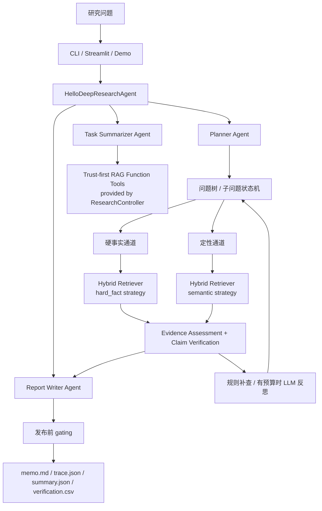

# BizIntel Agent — AI-Powered Evidence-Grounded Financial Research

> 🤖 Multi-Agent 编排 · LLM 驱动规划 · Hybrid RAG 混合检索 · NLI 幻觉控制 · 自主补查循环

一个基于 **多 Agent 协作架构** 的企业财务深度研究系统。系统由三个 AI Agent 协同工作 —— **Planner Agent** 将复杂研究问题自主拆解为原子子问题，**Summarizer Agent** 驱动双通道混合检索（BM25 + Dense + Cross-Encoder Rerank）并执行自主 gap-filling 补查循环，**Writer Agent** 基于 NLI 模型进行断言级事实核验后生成结构化研究备忘录。

**AI / Agent 核心能力：**

- 🧠 **LLM 驱动的自主规划** — 自动判断分析模式，将研究问题拆解为带通道标签的原子子问题树
- 🔄 **自主检索-评估-补查循环** — Agent 自主判断证据是否充分，不够就改写查询再检索，还不够就拒答
- 🔍 **Hybrid RAG 混合检索** — BM25 词汇匹配 + Dense Embedding 语义召回 + RRF 融合 + Cross-Encoder 精排，四阶段检索管线
- 🛡️ **NLI 幻觉控制** — 用 DeBERTa NLI 模型对每条生成断言做蕴含度评估，配合数值对齐、来源溯源、primary source 校验，主动拦截无证据支撑的结论
- 📋 **全链路决策回放** — 每个 Agent 决策记录在 `ResearchReplayRecord` 中，支持事后审计和 trace 回放


## 显著优势

### vs 传统方案对比

| 维度 | 直接问 ChatGPT | 简单 RAG（向量检索+拼 prompt） | **BizIntel Agent** |
|------|:-:|:-:|:-:|
| **问题拆解** | ❌ 一次性端到端生成 | ❌ 单次检索直接回答 | ✅ LLM 自主拆解为原子子问题树 |
| **检索质量** | ❌ 无检索，纯参数记忆 | ⚠️ 单路向量召回 | ✅ BM25 + Dense + RRF + Cross-Encoder 四阶段 |
| **证据不足处理** | ❌ 硬编 / 幻觉 | ❌ 拿到什么写什么 | ✅ 自主补查循环，还不够就拒答 |
| **事实核验** | ❌ 无 | ❌ 无 | ✅ NLI 蕴含度 + 数值对齐 + 来源溯源 |
| **幻觉控制** | ❌ 无法控制 | ⚠️ 靠 prompt 约束 | ✅ claim-level gating，unsupported 直接删除/降级 |
| **可解释性** | ❌ 黑盒 | ⚠️ 仅返回引用 chunk | ✅ 完整决策回放 trace + 核验报告 |
| **财务领域适配** | ❌ 通用模型 | ❌ 通用管线 | ✅ 硬事实/定性双通道 + primary source 校验 |

### 三大核心差异化

**1. 不是"套 API 的壳"，而是完整的 Agent 系统**

市面上大多数 RAG 项目的流程是 `query → 向量检索 → 拼进 prompt → LLM 回答`。BizIntel Agent 的执行链路是：

```
query → LLM 拆解子问题 → 分配通道(hard_fact/semantic) → 多轮检索-评估-补查循环
      → NLI 断言核验 → unsupported gating → 结构化 memo + trace + verification
```

每一步有独立的约束、预算和状态转移，不是一个大 prompt 解决所有问题。

**2. 不只是"能回答"，更关心"回答是否可信"**

系统在生成 memo 之后，会自动提取所有事实性断言（claims），逐条用 NLI 模型对照原始证据做蕴含度评估。数值型断言额外做金额/时期/货币符号/方向性词汇的严格对齐。不可信的内容在发布前被主动拦截，而不是等用户去发现。

**3. 不是通用 chatbot，而是面向财务研究的垂直系统**

硬事实通道和定性通道走不同的检索排序策略。财务数字必须来自 primary source（年报/季报/8-K）。研究问题按企业分析框架拆解（业务模型 / 财务数据 / 风险与展望），不是自由联想。

---

<details>
<summary><strong>📊 30 秒看效果：一次真实运行的完整产出</strong></summary>

### 运行来源

- 基于仓库内最新一次 `benchlive 150` 结果整理
- Cohort: `live_20260410_publishfix_parallel`
- Latest shard timestamp: `2026-04-10T11:10:13.000757`
- Selected case: `financebench_id_01488`
- GitHub 可直接查看的稳定样例：[showcase README](docs/showcases/benchlive150_latest_demo/README.md)
- 本地重新生成路径：`artifacts/benchlive150_latest_demo/`

### 问题

> Which business segment of JnJ will be treated as a discontinued operation from August 30, 2023 onward?

### 系统回答

**Consumer Health business** ✅

### 完整运行产出

- [showcase README](docs/showcases/benchlive150_latest_demo/README.md)
- [demo_memo.md](docs/showcases/benchlive150_latest_demo/demo_memo.md)
- [trace_overview.md](docs/showcases/benchlive150_latest_demo/trace_overview.md)
- [verification_preview.md](docs/showcases/benchlive150_latest_demo/verification_preview.md)

### Demo Memo 摘要

```md
Question: Which business segment of JnJ will be treated as a discontinued operation from August 30, 2023 onward?
Showcase answer: Consumer Health business

Direct Answer:
Johnson & Johnson said its Consumer Health business will be treated as a discontinued
operation from August 30, 2023 onward.

Key Evidence:
"As a result of the completion of the exchange offer, Johnson & Johnson will now
present its Consumer Health business financial results as discontinued operations..."
```

### 工作流轨迹

```text
 1. hello_deep_research_agent → started
 2. todo_planner → 拆出 3 个子问题
 3. hard_fact_group → q2 完成 (8 证据块, lane=hard_fact)
 4. semantic_group  → q1 完成 (8 证据块, lane=semantic)
 5. semantic_group  → q3 完成 (8 证据块, lane=semantic)
 6. report_writer   → 生成 memo + claim 核验
 7. hello_deep_research_agent → completed
```

### Case 指标

| 指标 | 结果 |
|------|------|
| Gold benchmark pass | 1.0000 |
| Strong support rate | 1.0000 |
| Unsupported claim rate | 0.0000 |
| Fabricated citation rate | 0.0000 |
| Primary source claim coverage | 1.0000 |
| Required subquestion coverage | 1.0000 |
| Required slot coverage | 1.0000 |
| Decision replay consistency | 1.0000 |
| Wrong entity / wrong period | 0.0000 / 0.0000 |

### Verification 指标

| 指标 | 结果 |
|------|------|
| Verified claims | 12 |
| Strong | 10 |
| Unsupported | 2 |
| Average NLI score | 0.8770 |
| Primary-source-supported rows | 12/12 |

### Cohort 快照

| 指标 | 结果 |
|------|------|
| Rows in cohort | 150 |
| Average strong support rate | 88.24% |
| Average verified claim coverage | 88.51% |
| Average numeric exact match rate | 92.19% |
| Average primary source claim coverage | 88.09% |
| Average gold benchmark pass | 15.33% |
| Average answer quality | 3.43 |

### 核验结果

| 类别 | 数量 | 说明 |
|------|:----:|------|
| Strong | 10 | NLI 蕴含分 ≥ 0.7，数值与来源对齐 |
| Unsupported | 2 | 模板文字或页眉页脚片段泄漏，已在核验里标出 |

### 关键证据

> As a result of the completion of the exchange offer, Johnson & Johnson will now present its **Consumer Health business** financial results as **discontinued operations**, including a gain of approximately $20 billion in the third quarter of 2023.
>
> — *[Source: johnson_johnson_2023_8k_dated_2023_08_30, Page 5]*

### Verification Preview 摘要

- Flagged claim 1: `earnings guidance included below have been recast to reflect the continuing operations of Johnson & Johnson.`
- Flagged claim 2: `the release and the Investors section of the Company's website at webcasts & presentations.`

> 完整样例入口见 [docs/showcases/benchlive150_latest_demo/README.md](docs/showcases/benchlive150_latest_demo/README.md)
> — GitHub 中保留了 demo memo、trace、verification 三份核心展示文件；如需本地 raw bundle，可运行 `make benchlive-demo`

</details>

---

## 做什么 / 不做什么

**做：**
- 单公司、固定资料包内的深度研究型 RAG
- 问题树拆解 → 双通道检索 → 证据评估 → 补查 → 核验 → 结构化 memo
- 全链路可回放：每个决策记录在 `ResearchReplayRecord` 中

**不做：**
- 开放网页搜索 / 实时行情
- 没有一级材料支撑的强结论
- 多公司自由比较（当前版本明确拒答）

## 核心能力

1. **问题树拆解** — 主问题 → 原子子问题，硬事实和定性分析分配到不同通道（`hard_fact` / `semantic`），各自有独立的排序策略和证据要求
2. **混合检索 + 双通道排序** — BM25 + Dense + RRF 融合 + Cross-Encoder 重排；硬事实通道先过滤公司/时期/来源类型再按指标命中排序，定性通道走语义重排 + 同桶安全聚合
3. **证据评估 + 有限补查** — 每个子问题做 NLI 蕴含评估 + 数值对齐检查，不够就补检索（最多 2 轮），还不够就拒答并记录原因
4. **断言级核验** — claim 提取 → NLI 打分 → 数值/时期/货币/方向性词汇对齐 → primary source 检查 → unsupported 降级或删除
5. **全链路可回放** — 输出 `memo.md` + `trace.json` + `summary.json` + `verification.csv`，支持决策冻结和重放

## 架构



### 读图要点

- **上层**是三段式 Agent 编排：Planner 拆问题 → Summarizer 逐个执行 → Writer 汇总
- **中层**是双通道检索：硬事实用指标命中优先排序，定性用语义重排
- **下层**是核验回路：每轮检索后做证据充分性评估，不够就补查；最终 Writer 发布前做 claim-level gating
- **所有决策**都写入 `ResearchReplayRecord`，支持事后回放

## 快速开始

```bash
# 1. 克隆仓库
git clone https://github.com/zuesjiang-cyber/bizintel-agent.git
cd bizintel-agent

# 2. 创建虚拟环境
python3 -m venv .venv
source .venv/bin/activate

# 3. 安装依赖
make install
```

### 配置 LLM

创建 `.env` 文件。直连 OpenAI：

```bash
cat > .env <<'EOF'
OPENAI_API_KEY="your-api-key"
OPENAI_MODEL="gpt-5.2"
EOF
```

使用 OpenAI-compatible provider（如本地网关）：

```bash
cat > .env <<'EOF'
OPENAI_API_KEY="your-api-key"
OPENAI_BASE_URL="https://your-provider.com/v1"
OPENAI_MODEL="your-model-name"
EOF
```

> 代码兼容旧别名 `MINIMAX_API_KEY` / `MINIMAX_API_BASE` 等，但 README 统一使用 OpenAI 官方命名。

### 离线体验

不需要 API Key，直接看完整流程：

```bash
make demo                # 离线 demo → artifacts/demo/
make benchlive-demo      # 用真实评测结果生成展示样例 → artifacts/benchlive150_latest_demo/
```

如果只是想直接浏览一套已经提交到仓库里的完整样例，不必先运行命令，直接打开：

- [docs/showcases/benchlive150_latest_demo/README.md](docs/showcases/benchlive150_latest_demo/README.md)
- [docs/showcases/benchlive150_latest_demo/demo_memo.md](docs/showcases/benchlive150_latest_demo/demo_memo.md)
- [docs/showcases/benchlive150_latest_demo/trace_overview.md](docs/showcases/benchlive150_latest_demo/trace_overview.md)
- [docs/showcases/benchlive150_latest_demo/verification_preview.md](docs/showcases/benchlive150_latest_demo/verification_preview.md)

## 使用方式

### CLI

```bash
# 单次研究
python run.py "Assess Stripe's revenue quality, valuation drivers, and key monitorables" --mode company

# 带 trace 和产物导出
python run.py "Assess Stripe's revenue quality" --mode company --artifact-dir artifacts/output --trace
```

### Web UI

```bash
make ui
```

UI 中可以查看：研究树 · 子问题状态 · 证据块 · 决策记录 · 最终 memo · claim 核验结果

## 输出产物

每次运行生成四个文件：

| 文件 | 内容 |
|------|------|
| `memo.md` | 最终研究备忘录 |
| `trace.json` | 研究树、子问题执行轨迹、补查记录、所有决策记录 |
| `summary.json` | 运行摘要、预算消耗、整体置信信息 |
| `verification.csv` | claim 级核验明细（NLI 分数、数值对齐、来源支撑） |

## 技术栈

| 用途 | 选型 |
|------|------|
| LLM | OpenAI-compatible（默认 `gpt-5.2`） |
| Embedding | `BAAI/bge-base-en-v1.5`（本地） |
| Reranker | `cross-encoder/ms-marco-MiniLM-L-6-v2`（本地） |
| NLI 核验 | `cross-encoder/nli-deberta-v3-base`（本地） |
| 稀疏检索 | `rank-bm25` |
| Web UI | Streamlit |
| 数据验证 | Pydantic v2 + pydantic-settings |
| PDF 解析 | pdfplumber |

---

<details>
<summary><strong>🔍 深度技术：双通道检索</strong></summary>

### 硬事实通道

适用于收入、利润率、现金流、同比/环比等口径明确的数字问题。

处理顺序：

1. 公司、时期、来源类型硬过滤
2. 指标/口径/数字命中优先
3. 来源可信度排序
4. 语义重排只做末端微调

### 定性通道

适用于管理层态度、风险、增长驱动、战略表述等定性问题。

处理顺序：

1. 公司、时期、来源类型硬过滤
2. BM25 + dense 混合召回
3. 交叉重排
4. 同桶安全聚合

检索管线不依赖 LangChain / LlamaIndex，而是用 numpy + rank-bm25 + sentence-transformers 自行实现，原因是需要精确控制双通道的排序策略差异和 trace 输出。

</details>

<details>
<summary><strong>🧠 深度技术：研究控制器与 Agent 编排</strong></summary>

### 三段式 Agent

- **Planner Agent** — 接收用户问题，拆成原子子问题，给每个子问题分配通道（hard_fact / semantic）、预算和状态
- **Task Summarizer Agent** — 对每个子问题执行检索 → 评估 → 补查循环，底层工具由 `ResearchController` 提供
- **Report Writer Agent** — 汇总所有子问题结果，生成结构化 memo，发布前做 claim-level gating

### 子问题状态

```text
pending → retrieving → completed
                     → needs_followup → (再次 retrieving)
                     → conflict
                     → refused
```

### 预算约束

- 最多 6 个子问题
- 每个子问题最多 2 轮补查
- 每个子问题最多保留 8 个证据块
- 单次研究最多 8 次 LLM 调用

### 模型调用分配

- 1 次：问题拆分
- 最多 4 次：分批生成子问题答案
- 1 次：最终总结
- 最多 2 次：补查查询改写建议

其余状态转移、拒答、通道修正全部走规则，不消耗 LLM 调用。

</details>

<details>
<summary><strong>📏 深度技术：评测体系</strong></summary>

### FinanceBench Open 150

基于 [FinanceBench](docs/financebench_open150_master_plan.md) 构建的 150 题评测集，使用真实 LLM provider + 完整混合检索管线。

评测指标分三层：

**安全指标**
- `unsupported_claim_rate` / `wrong_entity_rate` / `wrong_period_rate`
- `fabricated_citation_rate` / `contradiction_rate`

**研究树指标**
- `subquestion_completion_rate` / `required_subquestion_coverage`
- `required_slot_coverage` / `decision_replay_consistency`

**结果质量指标**
- `retrieval_hit` / `required_fact_recall` / `verified_claim_coverage`
- `strong_support_rate` / `primary_source_claim_coverage`
- `gold_benchmark_pass`

### 运行评测

```bash
make eval-retrieval              # 检索质量评测
make run-benchmark VERSION=v2    # 完整 benchmark
```

### 离线测试

```bash
make prepare-offline-suite       # 校验离线资产完整性
make test-offline-suite          # 离线 stub benchmark 冒烟测试
make check                       # lint + test + compile + offline suite
```

> 离线 stub benchmark 是管道冒烟测试，不是质量背书。它验证的是语料可读、runner 可回放、控制器可稳定输出 trace。

</details>

<details>
<summary><strong>📂 深度技术：离线语料</strong></summary>

当前离线体系围绕 3 个样本公司构建：

| 公司 | 用途 | 语料来源 |
|------|------|---------|
| `stripe` | demo / 轻量烟雾测试 | legacy `company_packs` |
| `cloudflare` | benchmark 主样本 | `raw` + `normalized` + `processed` |
| `fastly` | benchmark 主样本 | `raw` + `normalized` + `processed` |

```bash
make prepare-offline-suite    # 校验样本公司清单、资产完整性
make refresh-demo-corpus      # 重建 Stripe demo 语料
```

</details>

## 目录结构

```text
bizintel-agent/
├── agent/
│   ├── hello_research_agent.py  # 三段式 Agent 编排
│   ├── research_controller.py   # trust-first RAG 工具层
│   ├── orchestrator.py          # 顶层入口
│   ├── planner.py               # 问题拆解与意图分类
│   ├── executor.py              # 检索与 LLM 生成串联
│   ├── report_writer.py         # memo 组装与渲染
│   ├── artifacts.py             # trace/summary/verification 导出
│   ├── config.py                # 环境变量与默认配置
│   ├── schemas.py               # 全局数据模型（Pydantic + Enum）
│   └── prompts/                 # LLM 提示词模板
├── app/
│   └── streamlit_app.py         # Web UI
├── data/
│   ├── benchmark/               # 评测题集
│   ├── processed/               # chunk 化后的语料
│   └── raw/                     # 原始公司资料
├── docs/
│   ├── architecture.md          # 详细架构说明
│   ├── benchmark_methodology.md # 评测方法论
│   └── offline_test_system.md   # 离线测试说明
├── eval/
│   ├── benchmark_runner.py      # 评测执行器
│   └── evaluator.py             # 指标计算
├── retrieval/
│   ├── hybrid_retriever.py      # 双通道混合检索引擎
│   ├── chunking.py              # 滑动窗口分块
│   └── ingest.py                # 语料入库
├── verification/
│   ├── claim_extractor.py       # claim 提取
│   └── evidence_verifier.py     # NLI 核验 + 数值对齐
├── tests/                       # pytest 单元测试
├── tools/                       # 数据处理与辅助脚本
├── Makefile
├── pyproject.toml
└── run.py                       # CLI 主入口
```

## 主要代码入口

| 文件 | 职责 |
|------|------|
| [orchestrator.py](agent/orchestrator.py) | 顶层入口，调度 Agent 编排 |
| [hello_research_agent.py](agent/hello_research_agent.py) | 三段式 Agent：planner → summarizer → writer |
| [research_controller.py](agent/research_controller.py) | trust-first RAG 工具层：问题树、状态机、预算、护栏 |
| [hybrid_retriever.py](retrieval/hybrid_retriever.py) | 双通道检索、硬事实排序和 trace |
| [evidence_verifier.py](verification/evidence_verifier.py) | claim-level 核验与 NLI / 数值支撑检查 |
| [artifacts.py](agent/artifacts.py) | trace、summary、verification 导出 |

更完整的技术说明：

- [architecture.md](docs/architecture.md) — 五层架构详解
- [benchmark_methodology.md](docs/benchmark_methodology.md) — 评测方法论
- [offline_test_system.md](docs/offline_test_system.md) — 离线测试体系

## 现状与边界

1. **单公司研究优先。** 多公司自由比较不是当前版本的目标，系统会明确拒答。
2. **依赖本地资料包。** 不是实时联网研究系统，证据覆盖取决于 source pack 质量。
3. **离线 demo 是管道冒烟。** stub 模式展示系统形状，不代表研究结论质量。
4. **评测题集仍含历史比较题。** 对当前产品边界是压力测试，不应被包装成"系统已全面支持"。

## 验证

```bash
make test     # pytest
make lint     # ruff
make check    # lint + test + compile + offline suite 全部通过
```
