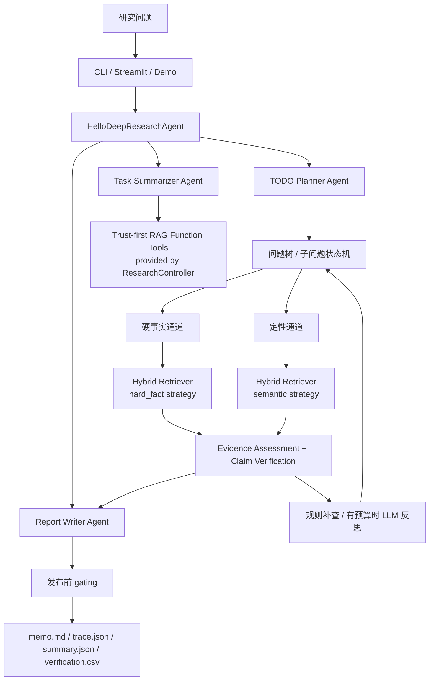

# 可信财务深度研究 RAG Agent

一个面向固定公司资料包的财务研究系统。  
它不是通用聊天助手，也不是“会写报告”的壳。它的目标更窄：

- 先把研究问题拆成最小子问题
- 每个子问题走受约束的检索与验证
- 证据不够就补查
- 还不够就拒答
- 最终输出带证据链、回放轨迹和核验结果的 memo

仓库目录、包名和主类名仍保留历史兼容名：`bizintel-agent` / `BizIntelAgent`。


## 定位

当前版本是：

- 单公司、固定资料包内的深度研究型 RAG
- 带研究控制器的受约束 Agent
- 证据优先、拒答优先、可回放优先

当前**不做**：

- 开放网页搜索
- 实时行情 / 交易信号
- 多公司自由比较
- 没有一级材料支撑的强结论

## 核心原则

1. 没证据就不写。
2. 用户指定的公司和时期优先级最高。
3. 硬事实和定性问题不能走同一套排序逻辑。
4. Agent 可以建议，但不能绕过规则护栏。
5. 宁可拒答，也不硬凑。

## 当前架构



## 什么叫 “Agent”

这个项目现在不是简单 workflow 了，但也不是自由发挥的多智能体系统。  
它的 agent 性主要来自四件事：

- 先把主问题拆成原子子问题
- 给每个子问题分配通道、预算和状态
- 在证据不足时做有限补查
- 记录所有关键决策，支持冻结和回放

这层逻辑现在由外层 [hello_research_agent.py](/Users/jiang/Documents/cv%20project/bizintel-agent/agent/hello_research_agent.py) 驱动，底层可信 RAG 工具由 [research_controller.py](/Users/jiang/Documents/cv%20project/bizintel-agent/agent/research_controller.py) 提供。

## 研究控制器

当前不是单一控制器顶层了，而是 hello-agents 风格的三段式外层 agent：

- `TODO Planner Agent`
- `Task Summarizer Agent`
- `Report Writer Agent`

其中底层 `ResearchController` 被降到工具层，负责：

- 构建任务对象
- 暴露子问题规划/检索/评估/补查/写作工具
- 保证公司/时期/来源/验证护栏不被绕过

### 子问题状态

- `pending`
- `retrieving`
- `needs_followup`
- `completed`
- `conflict`
- `refused`

### 关键预算

- 最多 `6` 个子问题
- 每个子问题最多 `2` 轮补查
- 每个子问题最多保留 `8` 个证据块
- 单次研究最多 `8` 次 LLM 调用

### 模型调用用途

- `1` 次：问题拆分
- 最多 `4` 次：分批生成子问题答案
- `1` 次：最终总结
- 最多 `2` 次：补查查询改写建议

其余状态转移、拒答、通道修正全部走规则。

## 双通道检索

### 硬事实通道

适用于：

- 收入
- 利润率
- 现金流
- 同比 / 环比
- 口径明确的数字问题

处理顺序：

1. 公司、时期、来源类型硬过滤
2. 指标/口径/数字命中优先
3. 来源可信度排序
4. 语义重排只做末端微调

### 定性通道

适用于：

- 管理层态度
- 风险
- 增长驱动
- 战略表述

处理顺序：

1. 公司、时期、来源类型硬过滤
2. BM25 + dense 混合召回
3. 交叉重排
4. 同桶安全聚合

## 主要代码入口

- [orchestrator.py](/Users/jiang/Documents/cv%20project/bizintel-agent/agent/orchestrator.py)
  顶层入口，当前已切到 hello-agents 风格外层 agent。

- [hello_research_agent.py](/Users/jiang/Documents/cv%20project/bizintel-agent/agent/hello_research_agent.py)
  外层 agent 骨架：planner -> task summarizer -> report writer。

- [research_controller.py](/Users/jiang/Documents/cv%20project/bizintel-agent/agent/research_controller.py)
  trust-first RAG 工具层：问题树、状态机、预算、补查和汇总工具。

- [hybrid_retriever.py](/Users/jiang/Documents/cv%20project/bizintel-agent/retrieval/hybrid_retriever.py)
  双通道检索、硬事实排序和 trace。

- [evidence_verifier.py](/Users/jiang/Documents/cv%20project/bizintel-agent/verification/evidence_verifier.py)
  claim-level 核验与 NLI / 数字支撑检查。

- [artifacts.py](/Users/jiang/Documents/cv%20project/bizintel-agent/agent/artifacts.py)
  trace、summary、verification 导出。

更完整的技术说明见：

- [architecture.md](/Users/jiang/Documents/cv%20project/bizintel-agent/docs/architecture.md)
- [benchmark_methodology.md](/Users/jiang/Documents/cv%20project/bizintel-agent/docs/benchmark_methodology.md)
- [offline_test_system.md](/Users/jiang/Documents/cv%20project/bizintel-agent/docs/offline_test_system.md)

## 快速开始

```bash
cd bizintel-agent
python3 -m venv .venv
source .venv/bin/activate
make install
```

如果要启用在线模型调用，创建 `.env`：

```bash
cat > .env <<'EOF'
OPENAI_API_KEY="your-openai-api-key"
OPENAI_API_BASE="https://your-openai-compatible-endpoint/v1"
OPENAI_MODEL="your-provider-supported-model"
EOF
```

注意：

- `OPENAI_MODEL` 必须和你的 `OPENAI_API_BASE` / 分发渠道真实支持的模型名匹配。
- 不要直接照抄 `gpt-5.2` 之类的占位值到第三方 OpenAI-compatible provider。
- 当前工程在 live provider 不可用时会自动回退到 rule-based decomposition / stub answer generation，这样 benchmark 不会直接崩溃，但结果会明确反映 provider 不可用带来的质量下降。

如果只是想看完整离线流程：

```bash
make demo
```

## 离线语料与测试系统

当前离线体系只围绕 3 个样本公司构建，不再假设“任意公司都能直接复现”：

- `stripe`
  - 用途：demo / 单公司轻量烟雾测试
  - 语料来源：legacy `company_packs`
- `cloudflare`
  - 用途：benchmark 主样本
  - 语料来源：`raw` + `normalized` + `processed`
- `fastly`
  - 用途：benchmark 主样本
  - 语料来源：`raw` + `normalized` + `processed`

准备离线套件：

```bash
make prepare-offline-suite
```

这会：

- 校验样本公司清单
- 校验 `raw / normalized / processed / benchmark` 资产是否齐全
- 确保 `local_facts.jsonl` 已生成
- 输出 `data/offline_suite/report.json`

跑完整离线测试系统：

```bash
make test-offline-suite
make check
```

这里的 `offline stub benchmark` 是管道冒烟，不是质量背书。  
它主要验证：

- 样本语料是否可读
- benchmark runner 是否能在离线模式下回放
- deep-research 控制器是否能稳定输出 trace

如果 stub 分数很差，但目标通过，这说明当前问题在研究质量，不是离线资产或测试链路坏了。

## 使用方式

### CLI

```bash
python run.py "Assess Stripe's revenue quality, valuation drivers, and key monitorables" --mode company
```

导出 trace：

```bash
python run.py "Assess Stripe's revenue quality, valuation drivers, and key monitorables" --mode company --artifact-dir artifacts/demo --trace
```

### Web UI

```bash
make ui
```

UI 里现在重点展示：

- 研究树
- 子问题状态
- 证据块
- 决策记录
- 最终 memo
- claim 核验结果

## 输出产物

- `memo.md`
  最终研究 memo

- `trace.json`
  研究树、子问题执行轨迹、补查记录、决策记录

- `summary.json`
  运行摘要、预算和整体置信信息

- `verification.csv`
  claim 级核验明细

## 评测

当前 benchmark 不再只看整题写作质量，也看研究控制器本身。

核心指标分三层：

### 安全指标

- `unsupported_claim_rate`
- `wrong_entity_rate`
- `wrong_period_rate`

### 研究树指标

- `subquestion_completion_rate`
- `required_subquestion_coverage`
- `required_slot_coverage`
- `decision_replay_consistency`

### 传统结果指标

- `retrieval_hit`
- `required_fact_recall`
- `verified_claim_coverage`
- `answer_quality`

运行：

```bash
make eval-retrieval
make run-benchmark VERSION=v2
```

## 目录结构

```text
bizintel-agent/
├── agent/
│   ├── orchestrator.py
│   ├── research_controller.py
│   ├── artifacts.py
│   ├── report_writer.py
│   └── schemas.py
├── app/
├── data/
│   ├── benchmark/
│   ├── processed/
│   └── raw/
├── docs/
├── eval/
├── retrieval/
├── tests/
├── tools/
├── verification/
├── Makefile
└── run.py
```

## 现状与边界

这个版本已经完成了从旧 section-workflow 到研究控制器主干的迁移，但有两个边界必须讲清楚：

1. 当前主系统优先做单公司研究。  
   多公司自由比较仍然不是这一版的主目标。

2. 评测层已经接入研究树指标，但 benchmark 题集里仍保留历史比较题。  
   这些题对当前产品边界是更严的压力测试，不应该被包装成“系统已全面支持”。

## 验证命令

```bash
make test
make check
```

当前这两个命令应当保持通过。
