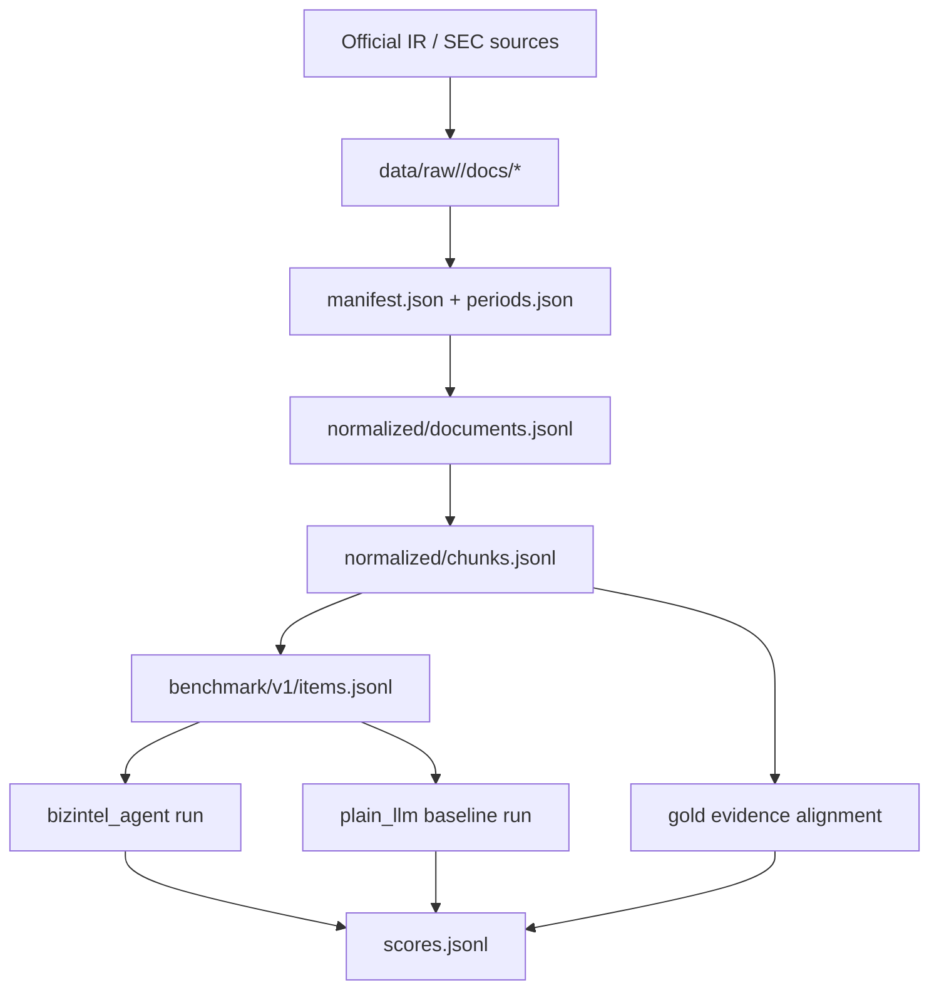

# Benchmark Data Layout

This benchmark is designed for a controlled same-corpus comparison:

- `bizintel_agent`
- `plain_llm`

The benchmark is only credible if the source pack is downloaded locally and evaluated against fixed evidence files.

Current frozen version:

- [v2 selection protocol](/Users/jiang/Documents/cv project/bizintel-agent/data/benchmark/v2/selection_protocol.md)
- [v2 corpus snapshot](/Users/jiang/Documents/cv project/bizintel-agent/data/benchmark/v2/corpus_snapshot.json)
- [v2 results write-up](/Users/jiang/Documents/cv project/bizintel-agent/docs/benchmark_v2_results.md)

## Evaluation Thesis

This benchmark is not trying to prove that BizIntel is a better general analyst than a frontier model.
It is trying to prove four narrower claims:

1. `planner + retrieval + rerank` improves period-aware evidence gathering.
2. `citation-aware synthesis` reduces unsupported factual claims versus a one-shot baseline.
3. `source prioritization` helps the system use transcripts, filings, and supplements in the right order.
4. `verification hooks` make failures easier to audit.

That means v1 should prefer narrow, defensible items over broad writing prompts.

## Directory Layout

```text
data/
  raw/
    cloudflare/
      manifest.json
      periods.json
      download_receipts.jsonl
      docs/
    fastly/
      manifest.json
      periods.json
      download_receipts.jsonl
      docs/
  normalized/
    cloudflare/
      documents.jsonl
      chunks.jsonl
    fastly/
      documents.jsonl
      chunks.jsonl
  benchmark/
    README.md
    v1/
      items.jsonl
      answers.jsonl
      evidence.jsonl
      scores.jsonl
      splits.json
      rubric.json
```

## Flow



## Rules

- Do not score against live web search.
- Do not mix raw docs with benchmark labels.
- Do not treat management decks as stronger than SEC filings.
- Treat `target_periods` as reporting periods only. Context documents can help, but they should not be required to satisfy an item.
- In `evidence.jsonl`, store both `anchor_text` and resolved `chunk_id`. `chunk_id` is for current runs; `anchor_text` is the recovery handle after chunk rebuilds.
- Freeze the item set and exclusion reasons before looking at benchmark scores.
- If the item set changes, bump the benchmark version instead of editing the current one in place after results.
- Keep `source_type` fixed to:
  - `ir_overview`
  - `annual_report`
  - `quarterly_report`
  - `quarterly_results`
  - `earnings_call_transcript`
  - `investor_presentation`
  - `investor_supplement`
  - `proxy_statement`
  - `event_page`

## Collection

Use:

```bash
make fetch-benchmark-sources COMPANY=cloudflare
make fetch-benchmark-sources COMPANY=fastly
```

That only downloads the raw source pack. Parsing into `normalized/` and generating chunk-level evidence still needs a dedicated normalization step.

## Anti P-Hacking

The benchmark must be built in this order:

1. Fix corpus inclusion based on source availability.
2. Freeze the mini-benchmark question set and the exclusion log.
3. Build normalized docs and chunk ids.
4. Resolve evidence anchors to chunk ids mechanically.
5. Run evaluation.

Not allowed:

- dropping hard questions after seeing results
- rewriting gold evidence to fit model outputs
- changing item wording after a failed run without bumping the version

See:

- [selection_protocol.md](/Users/jiang/Documents/cv project/bizintel-agent/data/benchmark/v1/selection_protocol.md)
- [corpus_audit.md](/Users/jiang/Documents/cv project/bizintel-agent/data/benchmark/v1/corpus_audit.md)
