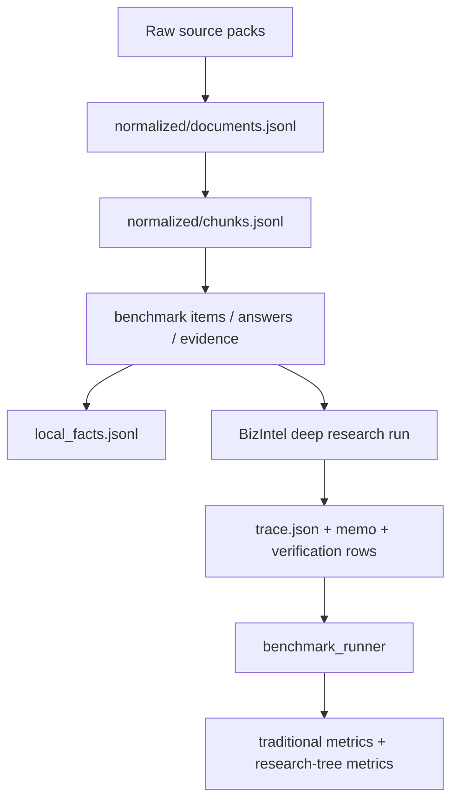

# Benchmark Data Layout

这个 benchmark 现在评测的是两层东西：

- 最终回答的证据质量
- 研究控制器本身的行为质量

它不再只是“整题写作分数”。

## 当前冻结版本

- [v2 selection protocol](/Users/jiang/Documents/cv%20project/bizintel-agent/data/benchmark/v2/selection_protocol.md)
- [v2 corpus snapshot](/Users/jiang/Documents/cv%20project/bizintel-agent/data/benchmark/v2/corpus_snapshot.json)
- [benchmark_methodology.md](/Users/jiang/Documents/cv%20project/bizintel-agent/docs/benchmark_methodology.md)

## 评测主张

当前 benchmark 只试图证明更窄的四件事：

1. 公司和时期边界不会被轻易打穿。
2. 研究问题能被拆成更小、可验证的子问题。
3. 子问题能走到正确的硬事实/定性通道。
4. 证据不足时系统会补查或拒答，而不是硬写。

## 目录结构

```text
data/
  raw/
    cloudflare/
    fastly/
  normalized/
    cloudflare/
    fastly/
  benchmark/
    README.md
    v1/
    v2/
      items.jsonl
      answers.jsonl
      evidence.jsonl
      local_facts.jsonl
      splits.json
      rubric.json
      profiles.json
      selection_protocol.md
      showcase_protocol.md
```

## 数据流



## 指标分层

### 安全指标

- `wrong_entity_rate`
- `wrong_period_rate`
- `unsupported_claim_rate`

### 研究树指标

- `subquestion_completion_rate`
- `required_subquestion_coverage`
- `required_slot_coverage`
- `decision_trace_coverage`
- `decision_replay_consistency`

### 结果指标

- `retrieval_hit`
- `verified_claim_coverage`
- `required_fact_recall`
- `answer_quality`

## 规则

- 不允许 live web search。
- 不允许把 benchmark 标签混进原始语料。
- 不允许把 management deck 当成强于 filing 的来源。
- `target_periods` 是硬边界，不是建议。
- `evidence.jsonl` 同时保存 `anchor_text` 和 `chunk_id`。
- `local_facts.jsonl` 一行只允许一个原子事实。
- question set、split、evidence anchors 必须先冻结，再跑分。
- 如果 item wording、证据或题集发生变化，必须 bump benchmark version。

## 重要边界

当前主系统的承诺能力仍然是单公司深度研究优先。  
因此：

- single-company items 是主评测对象
- comparison items 仍保留在题集中，主要用于压力测试和失败暴露

这两者不能混为一谈。
