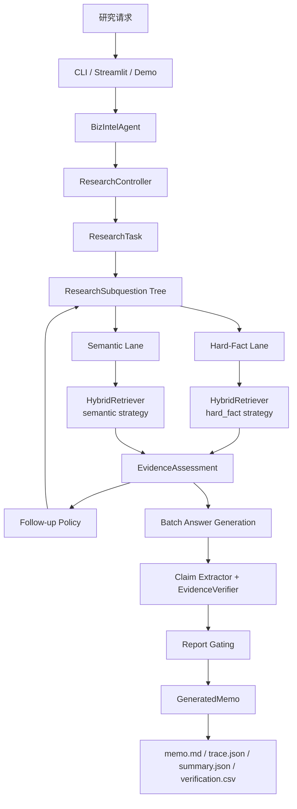
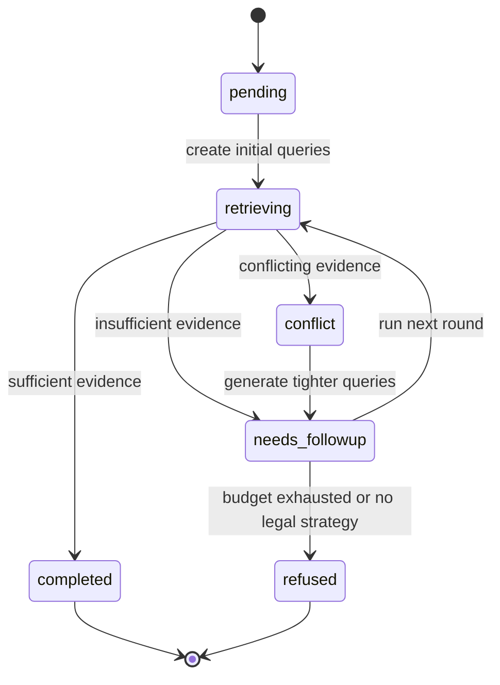

# 深度研究型可信财务 RAG Agent 架构

这份文档描述当前代码已经实现的主干，而不是历史版本的规划图。

## 1. 系统目标

系统目标不是“写得像分析师”，而是：

- 在固定资料包内完成一轮受约束的研究
- 让每个关键结论都能回到证据
- 在证据不足时补查或拒答
- 把研究路径完整记录下来，便于复盘和评测

## 2. 架构总览

## 3. 主对象

### `ResearchTask`

研究请求的根对象，包含：

- `query`
- `company_id`
- `period`
- `mode`
- 预算约束：
  - `max_subquestions`
  - `max_followup_rounds`
  - `max_evidence_per_question`
  - `llm_call_budget`

### `ResearchSubquestion`

原子研究问题，至少包含：

- `question_id`
- `text`
- `lane`
- `priority`
- `fact_slot`
- `metric_family`
- `required_period`
- `allowed_source_types`
- `needs_numeric_verification`
- `status`
- `rounds_used`

### `ResearchQuestionResult`

单个子问题的执行结果：

- 子问题元数据
- 命中的证据块
- 每轮证据评估
- 最终答案
- 验证结果
- 拒答原因
- follow-up 查询
- 完整 trace

### `ResearchReplayRecord`

控制器级回放对象：

- 原始任务
- 子问题状态快照
- 决策记录
- LLM 调用计数

## 4. 研究控制器

控制器位于 [research_controller.py](/Users/jiang/Documents/cv%20project/bizintel-agent/agent/research_controller.py)。

它负责：

- 拆分子问题
- 强制通道归类
- 分组执行
- 证据评估
- 发起补查
- 记录决策
- 最终汇总

它不负责：

- 绕过检索边界
- 越过验证直接写结论
- 自主扩大公司或时期范围

## 5. 子问题状态机

### 状态含义

- `pending`
  还没开始执行

- `retrieving`
  正在当前轮次检索

- `needs_followup`
  当前轮证据不足，但还允许补查

- `conflict`
  同时期、同口径、同指标下出现冲突证据

- `completed`
  达到证据门槛

- `refused`
  预算耗尽或没有合法补查策略

## 6. 智能与规则边界

### 用模型的地方

- 主问题拆分为子问题
- 分批生成子问题答案
- 最终总结
- 冲突/不足场景下的少量查询改写建议

### 必须规则化的地方

- 通道修正
- 状态转移
- 是否允许补查
- 是否拒答
- 公司 / 时期 / 来源过滤
- 硬事实排序

控制器可以建议，但不能越过规则护栏。

## 7. 双通道检索

检索入口位于 [hybrid_retriever.py](/Users/jiang/Documents/cv%20project/bizintel-agent/retrieval/hybrid_retriever.py)。

### 硬事实通道

目标：

- 收入
- 利润率
- 现金流
- 同比 / 环比
- 其他明确数字问题

排序逻辑：

1. 公司匹配
2. 时期匹配
3. 指标/口径命中
4. 数字命中
5. 内容类型
6. 来源可信度
7. reranker 末端微调

这条链路里，语义重排不是事实边界裁判，只是细排器。

### 定性通道

目标：

- 管理层态度
- 风险
- 驱动
- 战略

排序逻辑：

1. 公司/时期/来源硬过滤
2. BM25 + dense 混合召回
3. rerank
4. 同桶安全聚合

## 8. 证据评估

控制器用 `EvidenceAssessment` 判定一个子问题当前轮是否充分、冲突或不足。

### 硬事实充分

- 至少一个合法证据块
- 命中目标指标或数字
- 最佳蕴含分数达到阈值

### 定性充分

- 至少两个合法证据块
- 平均蕴含分数达到阈值
- 至少一个高可信来源

### 冲突

- 高相关证据指向相反结论
- 或同指标数字不一致
- 且不能被时期/口径差异解释

## 9. Follow-up 机制

补查策略有两层：

### 规则补查

- 硬事实：
  - `reported metric`
  - `numeric evidence`
  - `exact reported figure`
  - `gaap adjusted reconciliation`

- 定性：
  - `management commentary`
  - `source discussion`

### 有预算时的 LLM 反思

只在冲突场景下使用，用来提出更紧的 follow-up 查询。  
输出仍需通过规则边界校验。

## 10. 生成与核验

### 生成

控制器按通道分批生成子问题答案，而不是直接对整题写长文。

每个答案必须：

- 绑定证据
- 使用 `[Chunk: ...]` 和 `[Source: ...]`
- 不引入输入证据外的事实

### 核验

核验路径：

1. `ClaimExtractor`
2. `EvidenceVerifier`
3. `ReportWriter` gating

失败的数字型句子不会进入最终正文。

## 11. 最终 memo 结构

当前汇总器会输出三个主要 section：

- `hard_fact_findings`
- `semantic_findings`
- `evidence_gaps`

并生成：

- `executive_summary`
- `contract`
- `sources`
- `overall_confidence`

## 12. Trace 与导出

导出由 [artifacts.py](/Users/jiang/Documents/cv%20project/bizintel-agent/agent/artifacts.py) 负责。

`trace.json` 当前包含：

- 研究模式
- 原始 query
- 研究树
- 每个子问题的 trace
- 决策记录
- 最终答案
- claim 级验证行
- LLM 调用数

这也是 benchmark 读取控制器级指标的基础。

## 13. Benchmark 对齐

旧 benchmark 只关心整题写作；现在评测层已经扩展到控制器本身。

新增指标：

- `subquestion_completion_rate`
- `required_subquestion_coverage`
- `required_slot_coverage`
- `decision_trace_coverage`
- `decision_replay_consistency`
- `refused_subquestion_rate`
- `hard_fact_completion_rate`
- `semantic_completion_rate`
- `wrong_entity_rate`
- `wrong_period_rate`

传统指标仍保留，用来和旧 runs 对比：

- `retrieval_hit`
- `verified_claim_coverage`
- `unsupported_claim_rate`
- `required_fact_recall`
- `answer_quality`

## 14. 当前边界

这份架构已经完成了从旧 section-workflow 到研究控制器主路径的迁移，但还要明确边界：

- 当前主路径优先支持单公司研究。
- 多公司自由比较还不是这一版的承诺能力。
- benchmark 中保留的 comparison 题，当前更像压力测试，而不是产品承诺。

这不是缺文案，而是产品边界。
