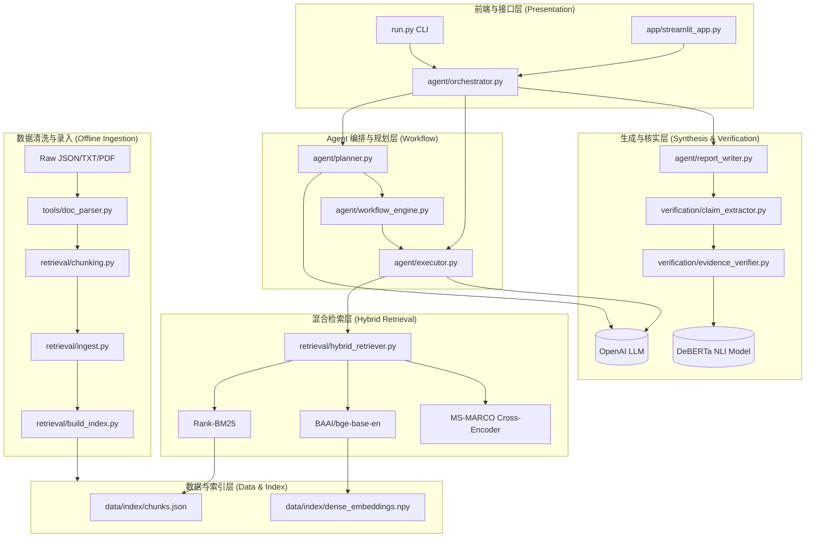

# 证据驱动可验证的企业财务研究Agent Flow: 完整技术文档 (Architecture & Technical Reference)

证据驱动可验证的企业财务研究Agent Flow 是一个用于自动化商业智能与研究报告生成的 AI 系统。本文档详细说明了系统的整体架构、核心模块、数据流向以及主要数据结构。

## 1. 系统架构概览 (System Architecture)

系统采用模块化设计，分为五个核心层：**数据入口层 (Ingestion)**、**检索层 (Retrieval)**、**流程编排层 (Agent Workflow)**、**生成与验证层 (Synthesis & Verification)**、和 **呈现层 (Presentation)**。



---

## 2. 核心模块详解 (Core Modules)

### 2.1 数据摄取层 (Data Ingestion)
负责将非结构化数据转化为可检索的标准格式。
- **`tools/doc_parser.py`**: 解析不同格式的文件 (TXT, JSON, PDF)，提取元数据 (`DocumentMeta`)。
- **`retrieval/chunking.py`**: `TextChunker` 将长篇文本切分为固定 token 大小的片段 (默认 400 tokens，50 tokens 重叠)，保留上下文边界。
- **`retrieval/ingest.py`**: 批量将源文件转换为 JSON Chunk 数组。
- **`retrieval/build_index.py`**: 为摄取的数据建立检索索引。

### 2.2 混合检索引擎 (Hybrid Retrieval)
文件: `retrieval/hybrid_retriever.py`

采用工业级的三阶段检索范式，最大化召回率和准确率：
1. **词汇匹配 (Lexical Search)**: 使用 `Rank-BM25` 匹配关键词。
2. **语义匹配 (Semantic Search)**: 使用 `BAAI/bge-base-en-v1.5` 生成 Dense Embeddings，计算余弦相似度。
3. **融合排序 (RRF Fusion)**: 使用 Reciprocal Rank Fusion 公式将 BM25 和 Dense 的排位融合。
4. **深度重排 (Cross-Encoder Reranking)**: 取前 20 个候选 chunk，送入 `cross-encoder/ms-marco-MiniLM-L-6-v2` 计算精准匹配得分，最终返回 Top K。

### 2.3 Agent 与工作流引擎 (Agent & Workflow Engine)
管理大模型的思考和执行路径。
- **`agent/planner.py`** (`Planner`, `QueryClassifier`): 
  - 接收用户查询，判断属于公司、行业还是竞品分析模式 (`AnalysisMode`)。
  - 从 `agent/schemas.py` 加载对应的分析框架（包含必选/可选步骤）。
  - 调用 LLM 为每一步骤生成具体的搜索查询语句（Search Queries）。
- **`agent/workflow_engine.py`** (`WorkflowEngine`, `WorkflowNode`):
  - 实现了一个支持拓扑执行、自动重试和超时的状态机。
  - 每个分析步骤对应一个 `WorkflowNode`。
- **`agent/executor.py`** (`AnalysisExecutor`):
  - 将 Planner 的步骤交给 Workflow Engine 执行。
  - 负责在每一步调用 `HybridRetriever` 获取 Context，并拼装 Prompt 给 LLM 生成当步的分析结果。

### 2.4 幻觉控制与验证层 (Factual Verification)
本项目核心亮点：防止 LLM “一本正经地胡说八道”。
- **`verification/claim_extractor.py`** (`ClaimExtractor`): 
  - 通过正则和启发式规则，从大模型生成的文本中剥离出“陈述性断言 (Claim)”。
  - 自动提取文本中的引用 `[Source: xxx]` 和数值 (Numbers)。
- **`verification/evidence_verifier.py`** (`EvidenceVerifier`):
  - 将提取出的 Claim 与被引用的原始 Chunk 送入 NLI (Natural Language Inference) 模型 (`cross-encoder/nli-deberta-v3-base`)。
  - 通过判断前提 (Evidence) 是否蕴含 (Entailment) 假设 (Claim)，计算事实置信度 (`ConfidenceLevel`: STRONG / MODERATE / WEAK / UNSUPPORTED)。
  - 对包含数字的 Claim 进行额外的数值比对验证。

### 2.5 报告生成层 (Report Generation)
文件: `agent/report_writer.py`
- 将执行层产出的各个零散 Section 进行组装。
- 注入 Verification Results 生成全篇评估指标。
- 调用 LLM 生成 Executive Summary。
- 提供 `render_memo()` 将内部结构 `GeneratedMemo` 渲染为美观的 Markdown，供 CLI 和 Streamlit 展现。

---

## 3. 主要数据结构 (Data Schemas)
系统大量使用 Enum 和 Pydantic/Dataclasses 以保证类型安全 (`agent/schemas.py`)。

- **`DocumentMeta`**: 记录来源元数据（标题、URL、日期、唯一 source_id）。
- **`TextChunk`**: 记录切割后的文本及关联的 `source_id`。
- **`RetrievedChunk`**: 继承自 `TextChunk`，额外记录检索阶段的得分 (BM25_rank, Dense_rank, Rerank_score)。
- **`AnalysisPlan`**: 包含用户 Query、模式 (`AnalysisMode`) 以及分解出的若干个 `AnalysisStep`。
- **`AnalysisStep`**: 包含步骤名称、描述、大模型为这步生成的具体搜索关键词列表。
- **`Claim`**: 结构化的知识断言。包含被引用的 Sources 和解析出的 Numbers。
- **`VerificationResult`**: 验证报告，包含 Claim 本身、NLI 分数、`ConfidenceLevel` 及解释说明。

---

## 4. 关键交互流程规范 (Sequence of Operations)

1. **输入阶段**: 用户通过 Streamlit 或命令行提供一句 Prompt (`Query`)。
2. **制定计划 (Plan)**: 
   - `Orchestrator` 将 `Query` 传给 `Planner`。
   - `Planner` 确定分析模式 (例如 `COMPANY_PROFILE`) 并载入子任务列表 (如: "概况", "财务", "竞对")。
   - `Planner` 为"财务"子任务生成具体的搜索词 (e.g., ["Stripe round valuations", "Stripe revenue 2023"])。
3. **执行流程 (Execute)**: 
   - `AnalysisExecutor` 遍历计划中的子任务。
   - 对"财务"任务的每一个搜索词，调用 `HybridRetriever` 拉取最佳的十个 `RetrievedChunk`。
   - 将检索到的原文拼接成 Context 送入 OpenAI API，附上当前的发现和前置上下文，生成当步内容。
4. **事实核验 (Verify)**:
   - 任务完成后，`ReportWriter` 获取各步的输出。
   - `ClaimExtractor` 切分句子，找到如 "Stripe was valued at $50B [Source: stripe_profile]" 的句子。
   - `EvidenceVerifier` 拉取 `stripe_profile` 的相应 Chunk 送给 NLI 打分。
5. **输出渲染 (Render)**:
   - 计算得到文章事实支持率 (Citation Coverage)。
   - 聚合生成 Executive Summary，统一格式化 Markdown，传给 UI 侧渲染。

---

## 5. 目录组织 (Directory Structure)

```text
bizintel-agent/
├── agent/                  # 核心智能体与工作流框架
│   ├── config.py           # 环境变量与默认配置 (pydantic-settings)
│   ├── executor.py         # 串联 Retrieval 与 LLM 生成
│   ├── orchestrator.py     # 顶层外观模式，对外暴露 research 接口
│   ├── planner.py          # 任务拆解与意图分类
│   ├── report_writer.py    # 组装最终结果与排版
│   ├── schemas.py          # 全局数据模型
│   ├── workflow_engine.py  # 节点状态机
│   └── prompts/            # LLM 提示词模板
│       └── synthesis.py    
├── app/                    # 展现层
│   └── streamlit_app.py    # Web 交互界面
├── data/                   # 本地数据库与语料
│   ├── index/              # 构建的稠密与稀疏检索索引
│   ├── processed/          # 完成 chunk化 的知识单元
│   ├── company_packs/      # 原始公司资料存放处
│   └── eval_cases/         # 测试题库
├── docs/                   # 相关文档
│   └── architecture.md     # 本文档
├── eval/                   # 系统评测脚本
│   └── evaluator.py        # 基于 benchmark.json 的准确率测试
├── retrieval/              # 数据清洗与搜索引擎框架
│   ├── build_index.py      # 构建离线搜索索引脚本
│   ├── chunking.py         # 智能滑动窗口分块
│   ├── hybrid_retriever.py # 多路召回重排引擎
│   └── ingest.py           # 数据入库脚本
├── tests/                  # Pytest 单元测试
├── tools/                  
│   └── doc_parser.py       # 多模态解析(JSON/PDF/TXT)
├── pyproject.toml          # 项目包依赖管理
└── run.py                  # CLI 主入口
```

## 6. 模型与依赖 (Models & Dependencies)
为了平衡速度与开销，默认采用了如下模型栈（均在 `agent/config.py` 中配置）：
- **LLM**: `gpt-4o` (OpenAI 负责规划与报告生成)
- **Embedding**: `BAAI/bge-base-en-v1.5` (本地，SentenceTransformers 负责语义向量化)
- **Reranker**: `cross-encoder/ms-marco-MiniLM-L-6-v2` (本地，SentenceTransformers 负责重排精确打击)
- **NLI/Verification**: `cross-encoder/nli-deberta-v3-base` (本地，负责幻觉检测)

### 依赖库
核心三方依赖记录于 `pyproject.toml`：
- `openai`, `sentence-transformers`, `rank-bm25`, `pdfplumber` (解析处理)
- `streamlit`, `fastapi`, `pydantic`, `pydantic-settings` (Web 与数据验证)
- `pytest`, `ruff` (工程化)
