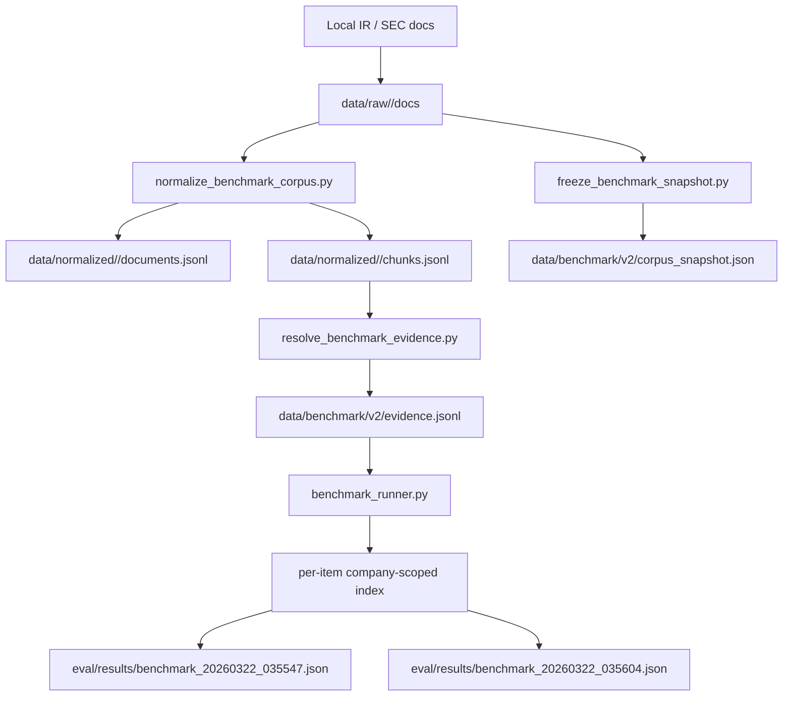

# Benchmark v2 Results

This file records the current frozen benchmark state for `bizintel-agent`.

## What `v2` Is

`v2` is a `12-item` mini benchmark over local Cloudflare / Fastly IR materials.

- Protocol: [selection_protocol.md](/Users/jiang/Documents/cv project/bizintel-agent/data/benchmark/v2/selection_protocol.md)
- Corpus audit: [corpus_audit.md](/Users/jiang/Documents/cv project/bizintel-agent/data/benchmark/v2/corpus_audit.md)
- Snapshot: [corpus_snapshot.json](/Users/jiang/Documents/cv project/bizintel-agent/data/benchmark/v2/corpus_snapshot.json)

Snapshot id:

- `d2a26985dd7e3630873716152085d069f9fe2575c823d710178d371395050826`

Corpus shape:

- `cloudflare`: `12` local docs, `631` normalized chunks, `0` missing docs
- `fastly`: `12` local docs, `484` normalized chunks, `2` missing docs carried in the manifest but excluded from the runnable corpus

## Why `v2` Replaced `v1`

`v1` was useful as a diagnostic dry run, but not clean enough to extend. `v2` fixes four methodology problems:

1. `CMP-001`, `TS-002`, and `TS-003` now have item schema aligned with their gold evidence.
2. `TS-003` now uses exact substring anchors instead of all-token-overlap bindings.
3. The benchmark now records a hash-level corpus snapshot instead of only counts.
4. The runner now builds per-item company-scoped indexes, so single-company items no longer pull irrelevant-company documents.

Because the methodology changed, `v1` and `v2` scores should not be presented as a pure model-improvement delta.

## Execution Flow



## Commands Run

```bash
make build-benchmark-kb VERSION=v2
make run-benchmark VERSION=v2 ARGS='--split dev'
make run-benchmark VERSION=v2 ARGS='--split test'
make check
```

## Result Files

- Dev: [benchmark_20260322_035547.json](/Users/jiang/Documents/cv project/bizintel-agent/eval/results/benchmark_20260322_035547.json)
- Test: [benchmark_20260322_035604.json](/Users/jiang/Documents/cv project/bizintel-agent/eval/results/benchmark_20260322_035604.json)

All runs used:

- `mode = offline_stub_llm_dummy_retrieval`

That means:

- retrieval models were loaded in offline dummy mode
- memo generation used the offline stub path
- verifier attempted to load the NLI model but fell back to the dummy verifier because the environment could not complete the model load

So these are diagnostic results, not live-model benchmark wins.

## Scores

| Split | Items | Retrieval Hit | Citation Coverage | Unsupported Claim Rate | Required Fact Recall | Avg NLI Score | Answer Quality |
|------|------:|--------------:|------------------:|-----------------------:|---------------------:|--------------:|---------------:|
| Dev  | 6 | 0.83 | 0.25 | 0.75 | 0.33 | 0.22 | 2.17 |
| Test | 6 | 0.83 | 0.23 | 0.77 | 0.39 | 0.21 | 2.33 |
| All  | 12 | 0.83 | 0.24 | 0.76 | 0.36 | 0.21 | 2.25 |

Failure tags across all `12` items:

- `S5_overclaim`: `12`
- `R1_missing_primary_source`: `10`
- `S1_incomplete_answer`: `8`
- `V4_conflict_not_detected`: `1`

## What Improved In `v2`

- Cross-company contamination in `sources_used` for single-company items is now `0`.
- Gold evidence bindings are cleaner and less brittle.
- The split now covers all major benchmark categories in `dev`.
- The benchmark version is now tied to a content-hash snapshot, not just file counts.

## What These Results Prove

- The benchmark harness is real, reproducible, and auditable.
- The current system can usually retrieve at least part of the right evidence set on this frozen corpus.
- The current bottleneck is not only retrieval; synthesis discipline is still weak, especially around overclaiming.

## What These Results Do Not Prove

- They do not prove `bizintel_agent` beats a plain LLM baseline.
- They do not prove live-web or current-market performance.
- They do not prove the NLI verifier is behaving like the real DeBERTa model in this run.
- They are not strong enough to put the numeric scores on a resume.

## Resume-Safe Framing

Safe:

- “Built a frozen same-corpus benchmark for citation-aware company research using local IR/SEC materials, chunk-level gold evidence, and anti-p-hacking evaluation rules.”
- “Implemented a reproducible evaluation harness for retrieval hit rate, citation coverage, unsupported-claim rate, and fact recall on period-sensitive company-analysis questions.”

Not safe:

- “Improved benchmark performance by X%”
- “Proved BizIntel beats plain LLM baselines”
- “Validated analyst-grade factuality”
