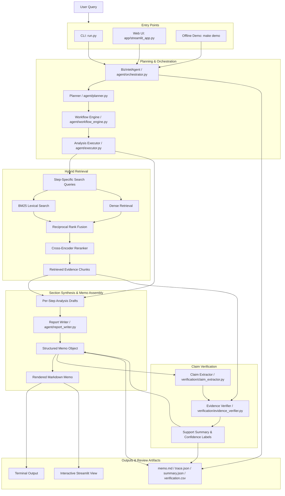
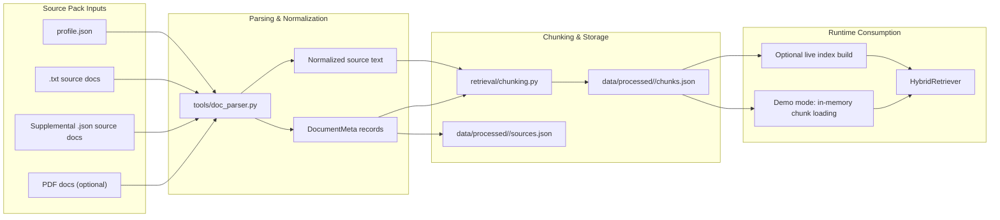

# 证据驱动可验证的企业财务研究Agent Flow Full Flow Architecture

This document provides a complete end-to-end architecture diagram for the current verified project flow.

## 1. End-to-End System Flow

## 2. Corpus Preparation Flow

## 3. Interview-Friendly Narrative

The shortest accurate way to explain this diagram is:

1. Source packs are normalized into chunked evidence.
2. A user query is classified and decomposed into analysis steps.
3. Each step runs through hybrid retrieval instead of a single vector lookup.
4. Retrieved evidence is turned into section drafts and assembled into a memo.
5. Claims in the memo are checked against evidence and exported with trace artifacts.

## 4. Scope Notes

- This diagram reflects the current verified project flow.
- It includes offline demo mode, reproducible artifacts, and current hybrid retrieval.
- It does not claim live web ingestion or production-grade evaluation beyond what is already implemented.
